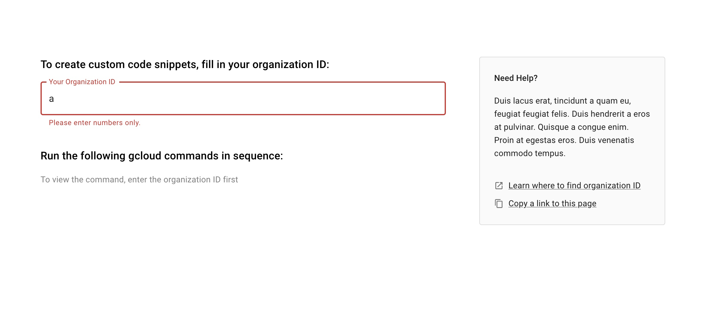
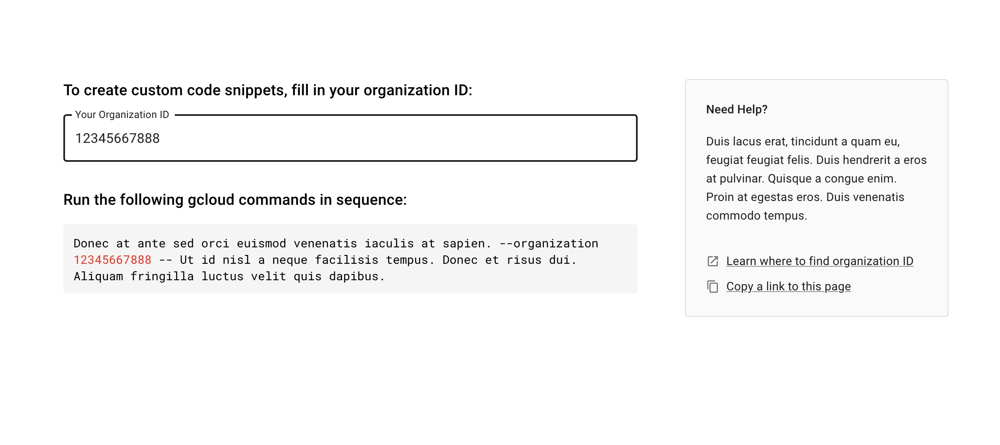
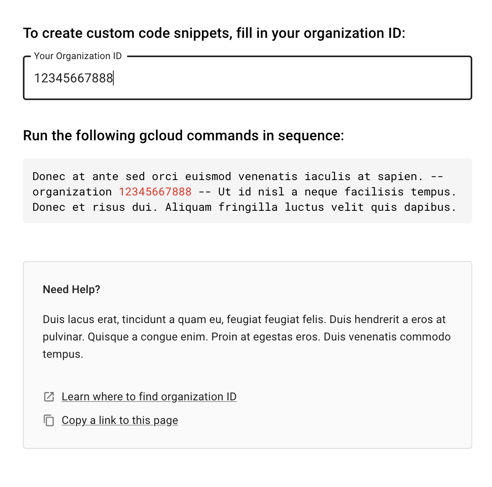

# Resolution

## Screen shots

1. User enters to the screen
   

2. She fills incorrect entry
   

3. She fills expected ID
   

4. Using on small screen
   

   ## File structure

   - _src/features/gcloudCommand/_ folder contains the application specific components
   - _src/generic/_ folder contains component which could be used across the application

   ## Remarks

   - The gcloud command code snippet is purposely not aligned with the bottom of the help card to keep the layout flexible in any screen size.

   - I struggled to decide which elements to extract. I decided to keep the Typography, and not wrap it around custom component, I created custom themes instead.
